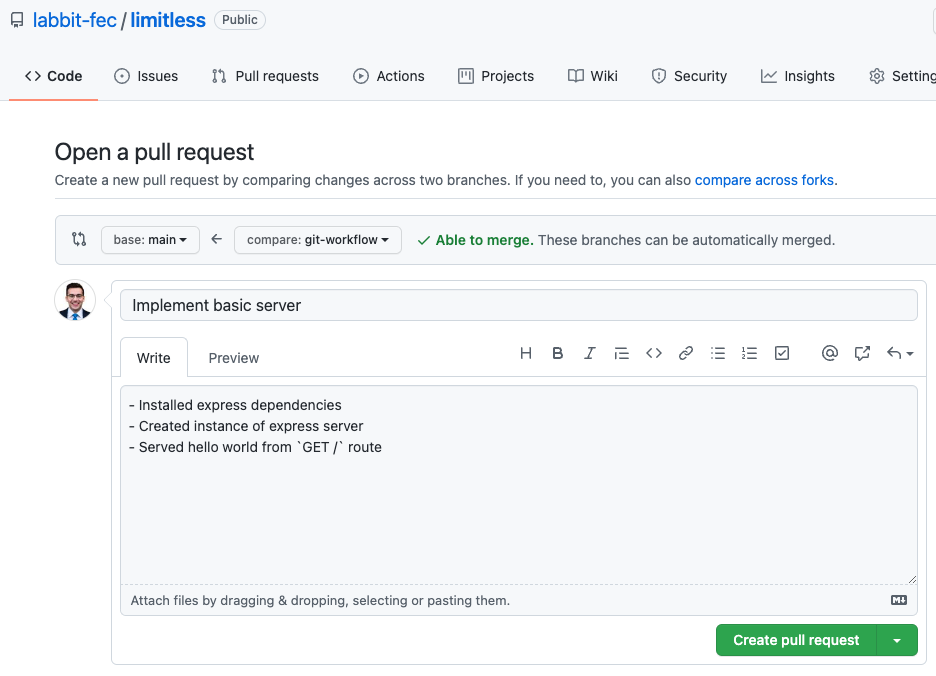

# Limitless `git`  workflow

## Single source of truth

The `main` branch of [this](https://github.com/labbit-fec/limitless) remote repository will serve as our **single source of truth**. It will represent the latest  version of production-ready code. Code will be merged into the `main` branch once a pull request to the branch has been reviewed and approved.


## Cloning the repository
Your first step will be cloning our remote repository. Navigate to the appropriate folder on your local machine and execute the following command:
```
git clone https://github.com/labbit-fec/limitless.git <desired_folder_name>
```

Then change into your newly created directory:
```
cd <desired_folder_name>
```

Confirm that you are configured with the correct remote repository:
```
git remote -v
```
You should see the following:
```
origin	https://github.com/labbit-fec/limitless.git (fetch)
origin	https://github.com/labbit-fec/limitless.git (push)
```

### Removing / renaming your remote repository
If you had initially configured your workflow to work off of a **fork** of the organization's repository, and you cloned that forked repository, your `origin` remote may already be connected to your personal forked repository. In that case, you would see the following in your remote connections:
```
...
origin  https://github.com/<your_github_username>/limitless.git (fetch)
origin  https://github.com/<your_github_username>/limitless.git (push)
...
```
If that is the case, you should first remove that connection to your personal repository, as follows, assuming it was called `origin`. If it was called something else, you can replace `origin` with the name of the remote connection to your personal GitHub respository.
```
git remote remove origin
```
Then, create a remote connection with the **organization's** repository, and call it `origin`:
```
git remote add origin https://github.com/labbit-fec/limitless.git
```
Check that you have the remote connection:
```
git remote -v
```
You should only see the following:
```
origin  https://github.com/<your_github_username>/limitless.git (fetch)
origin  https://github.com/<your_github_username>/limitless.git (push)
```

## Working on a feature
> No work should be done on the `main` branch.

All work should be done on a **feature branch**; that is, an existing or newly created branch designated to the feature on which you are working.

Whether you already have a branch that you are revisting, or are creating a new branch, your first step is to `pull` down the latest from the **source of truth**, the `main` branch.

If you are not already on the `main` branch on your local machine, switch to it:
```
git checkout main
```

Then, `pull` down the latest master branch:
```
git pull origin main
```

Follow the steps under **either** A **or** B below, depending on if you are **revisting** or **creating a new** branch.

> One important goal of our git workflow is to avoid encountering merge conflicts in your pull requests in GitHub. This can be avoided by always rebasing your feature branch to the latest `origin/main` branch immediately before working on your branch, and immediately before pushing your branch up, resolving merge conflicts in both cases locally, as described below.

### A. Revisting an existing branch
Checkout your existing feature branch:
```
git checkout <feature_branch_name>
```

Rebase your feature branch based on the latest `main` branch:
```
git rebase main
```

***Merge conflicts may arise in this step.*** Resolve any merge conflicts in VS Code, working with other members of the team as needed. Then, execute the following:
```
git rebase --continue
```
*You do **not** need to commit any work as you are resolving the conflicts in a `rebase`.*

### B. Creating a new branch
From the `main` branch, create and checkout a new branch:
```
git checkout -b <new_feature_branch_name>
```
*You do not need to `rebase` in this case, since you are creating a branch based on the latest `main` branch that you have pulled down.

### Implementing changes to your feature
Implement the changes to your feature's code, making frequent, small commits as follows:
```
git add .
git commit -m "<your_commit_message>"
```
Use descriptive commit messages in the present tense; for example:
```
git commit -m "implement click event handler on checkout button"
```
In order to **avoid substaintial merge conflicts**, while working on your feature branch, aim to regularly `rebase` your branch to the latest `main` branch on the remote repository (`origin`).

Commit your latest changes to your feature branch, and then switch back to the `main` branch on your local machine:
```
git checkout main
```

`pull` down the latest version of the `main` branch at the `origin`:
```
git pull origin main
```
Switch back to your feature branch:
```
git checkout <your_feature_branch_name>
```
Rebase your feature branch based on the latest `main` branch that you have pulled down:
```
git rebase main
```

***Merge conflicts may arise in this step.*** Resolve any merge conflicts in VS Code, working with other members of the team as needed. Then, execute the following:
```
git rebase --continue
```
*You do **not** need to commit any work as you are resolving the conflicts in a `rebase`.*

### Pushing your changes to the remote repository
After making your last commit, but before pushing your changes to the remote repository (`origin`), switch back to the `main` branch:
```
git checkout main
```
`pull` down the latest version the `main` branch at the `origin`:
```
git pull origin main
```
Switch back to your feature branch:
```
git checkout <feature_branch_name>
```
Rebase your feature branch based on the latest `main` branch that you have pulled down:
```
git rebase main
```
***Merge conflicts may arise in this step.*** Resolve any merge conflicts in VS Code, working with other members of the team as needed. Then, execute the following:
```
git rebase --continue
```
*You do **not** need to commit any work as you are resolving the conflicts in a `rebase`.*

Then, `push` your feature branch to the remote repository. If it is your first time pushing this branch to the remote repository, include the `-u` flag to set the upstream branch:
```
git push -u origin <your_feature_branch_name>
```
For subsequent pushes of this branch, you can just use the following, since the upstream branch has already been configured:
```
git push
```
### Incorporating your updates into the `main` branch
Once you have pushed your feature branch to its upstream branch at the `origin`:
1. Go to your feature branch on the `origin` GitHub repository
2. Create a **pull request** from your feature branch to the `main` branch
3. In the **title** of the pull request: reference the name of the corresponding Trello ticket
4. In the **comments**: describe your changes and any details that will be helpful for the reviewer

For example:


Finally:
1. Add the pull request ID# to the corresponding Trello ticket
2. Send a message to the team's PR channel in Slack to let everyone know that you have made a pull request
3. Any other member of the team may pick up the PR for review, responding in the Slack channel to note they are doing so
